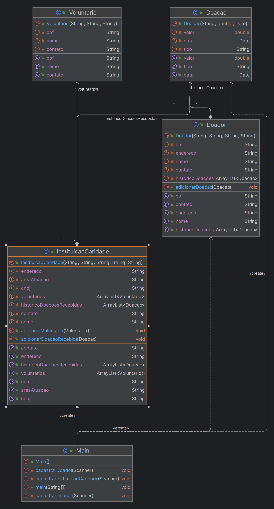

# Sistema de Gestão de Assistência Humanitária

## Integrantes
### 2ESPX

- Caíque Walter Silva RM550693
- Matheus José de Lima RM551157

## Descrição do Projeto
O Sistema de Gestão de Assistência Humanitária foi desenvolvido em resposta a uma tragédia que assolou o estado do Rio Grande do Sul, deixando centenas de famílias desabrigadas e em situação de vulnerabilidade. Com o objetivo de auxiliar na coordenação e distribuição de assistência humanitária para as vítimas, este sistema foi projetado para proporcionar uma plataforma eficiente de gerenciamento de doações, voluntários e instituições de caridade envolvidas na prestação de auxílio.

## Funcionalidades
### Cadastro de Doadores
Os doadores podem se cadastrar no sistema fornecendo as seguintes informações:
- **Nome**: Nome completo do doador.
- **CPF**: Número de CPF do doador para identificação.
- **Endereço**: Endereço do doador para fins logísticos.
- **Contato**: Informações de contato do doador (telefone, e-mail, etc.).
- **Histórico de Doações**: Registro das doações realizadas pelo doador.

### Cadastro de Instituições de Caridade
As instituições de caridade podem se cadastrar no sistema fornecendo as seguintes informações:
- **Nome**: Nome da instituição de caridade.
- **CNPJ**: Número de CNPJ da instituição para identificação legal.
- **Endereço**: Endereço da instituição para entrega de doações e atividades voluntárias.
- **Contato**: Informações de contato da instituição.
- **Área de Atuação**: Área específica de atuação da instituição (ex: assistência social, saúde, alimentação, etc.).
- **Voluntários**: Lista de voluntários associados à instituição.
- **Histórico de Doações Recebidas**: Registro das doações recebidas pela instituição.

### Cadastro de Voluntários
Voluntários podem se cadastrar no sistema fornecendo as seguintes informações:
- **Nome**: Nome completo do voluntário.
- **CPF**: Número de CPF do voluntário para identificação.
- **Contato**: Informações de contato do voluntário para coordenação de atividades.

### Registro de Doações
As doações podem ser registradas no sistema com as seguintes informações:
- **Tipo**: Descrição do tipo de doação (ex: alimentos, roupas, dinheiro, etc.).
- **Valor**: Valor monetário da doação (para doações em dinheiro).
- **Data**: Data em que a doação foi realizada.

### Interface de Linha de Comando (CLI)
O sistema possui uma interface de linha de comando que permite aos usuários interagir com as funcionalidades do sistema de forma simples e intuitiva.

## Diagrama de Classes
O diagrama de classes abaixo ilustra a estrutura do sistema:



## Como Executar
1. Clone o repositório para o seu ambiente local.
2. Certifique-se de ter o JDK (Java Development Kit) instalado em seu sistema.
3. Abra um terminal e navegue até o diretório do projeto.
4. Compile os arquivos `.java` utilizando o comando `javac`.
5. Execute o arquivo `Main.java` utilizando o comando `java`.

Exemplo de execução no terminal:
```shell
$ javac *.java
$ java Main
